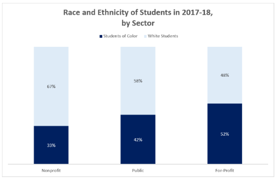
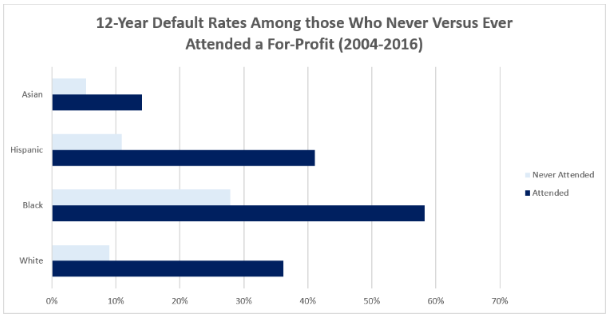
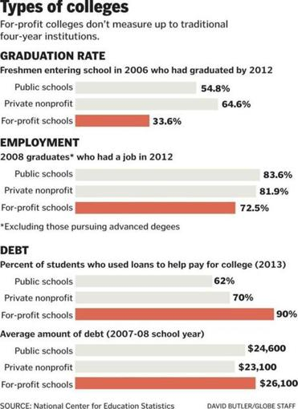
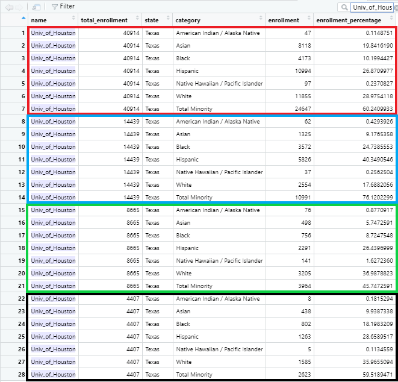

```{r}
library(git2r)
library(usethis)
```

# **Racial Demographics at For-Profit and Not-For-Profit Educational Institutions**

### *"Until we get equality in education, we won't have an equal society."* 
#### ~ Supreme Court Justice Sonia Sotomayor

## **Topic Background**

Each of our team members originally selected a few datasets that we compared as a group.  Our group decided to explore a dataset Ana found related to the topic of racial and ethnic diversity at two-year and four-year colleges and universities in the United States.  We initially thought to compare diversity at two-year community colleges versus 4-year schools and also were curious about the variations in diversity between the two that could be found comparatively across the country.

As we were exploring the dataset we identified a number of named colleges and universities that are known as "for-profit" institutions. Some of these institutions have been the subject of recent lawsuits regarding predatory (Halperin, 2020; Legal Services Center, 2020; Redman, 2020).  The high number of current lawsuits regarding for-profit colleges' predatory behaviors are a result of the actions of current Education Secretary Betsy DeVos.  In 2019, DeVos "repealed an Obama-era regulation that sought to crack down on for-profit colleges and universities that produced graduates with no meaningful job prospects and mountains of student debt they could not hope to repay" (Green, 2019. para. 1).  Another action that DeVos took was to deny debt forgiveness to students who had been prey to for-profit predatory educational institutions (Lobosco, 2019; Turner, 2019).  We were aware of past and recent news articles describing the marketing strategies of these colleges that were aimed at students of color, low-income students, immigrant communities and students who are first in their family to go to college (Bonadies et al. 2018; Conti, 2019; Voorhees, 2019).  Previous studies have found that loan debt is higher for students who have attended For-Profit institutions, which disproportionately affects students of color.


```{r pressure2, echo=FALSE, fig.cap="**Race and For-Profits**", out.width= '75%'}


```
(Body, 2019)


```{r pressure3, echo=FALSE, fig.cap="**Loan Default Rates at For-Profits**", out.width= '75%'}


```
(Body, 2019)

Despite their high cost, For-profit institutions have a lower graduation rate and employment rate than non-profit institutions.

```{r pressure4, echo=FALSE, fig.cap="**For-Profit Graduation & Employment Rates**", out.width= '50%'}


```
(Lopez, 2015)

We will examine our dataset and explore possible consistencies and/or inconsistencies with these previous reports.

## **Initial Questions**

1. How do racial and ethnic demographics vary between not-for-profit institutions and for-profit colleges in our dataset?

2. In our dataset, do the For-Profit Institutions have a higher proportion of students of color than other community colleges and four-year colleges, thus providing support to the argument that For-Profit colleges target students of color for enrollment?

## **Definitions**:


**For-Profit Institutions**:  For-profit institutions are defined by the way that "revenue earned by the school is invested".  For-profit colleges have investors who want to make a profit. Their operations management is determined in part on maximizing the return profit for investors.  "Money earned by the shcool may be used to pay out investors and award boneuses to executives, as well as sustain the operation's profitability through aggressive marketing and recruitment strategies" (TBS Staff, 2019, para. 8)  

**Not-for Profit Institutions**:  Non-profit colleges can be either public or private. Regardless of whether the school is public or private, non-profit colleges must "reinvest the money earned through enrollment into the educational mission" (TBS Staff, 2019, para. 8).  

## **Webscraping and Randomly Selecting Sample of 35 For-Profit Colleges**

Our dataset did not include information on whether colleges were for-profit.

In order to determine which of the schools on our list were for-profit institutions, we decided to find a website with a list of for-profit institutions, scrape the data from that website, to create a second dataset with a list of for profit schools.  

### Following Web-Scraping Tutorial to Scrape Wikipedia Website

### Loading Libraries
```{r}
#Loading the rvest package
library('rvest')
library(tidyverse)
library(dplyr)
```

```{r}
#Specifying the url for desired website to be scraped
url <- 'https://en.wikipedia.org/wiki/List_of_for-profit_universities_and_colleges'

#Reading the HTML code from the website
webpage <- read_html(url)

#Using CSS selectors to scrape the rankings section
for_profit_html <- html_nodes(webpage,'li a')

#Converting the ranking data to text
for_profit <- html_text(for_profit_html)

#Let's have a look at the rankings
head(for_profit)
```

### Viewing new index
```{r}
for_profit
```

```{r}
for_profit_new <- for_profit[25:215]
head(for_profit_new)
```
### Cleaning our for-profit list
```{r}
for_profit_new[167:168] <- NA
for_profit_new
```

```{r}
final_for_profit <- na.omit(for_profit_new)
```

```{r}
#final_for_profit
 df <-data_frame(final_for_profit)
df
```

The webscraping exercise produced a list of nearly 200 schools.  We decided to take a random sample of n=35  schools on that list, which also appeared in our dataset. We selected 35 schools so that we would comply with the Central Limit Theorem.  The result of the randomization we ran on the webscraped data is below.  Each of us compared a portion of the list with our dataset to ensure that all of our selections were present on both lists.  We ran multiple randomizations until we had a consistent list with 35 schools appearing on both datasets. Some of the randomly chosen schools had multiple locations, as is shown in the example set of schools below.  The final list of schools was geographically diverse.

```{r}
sample_n(df,35)
```

### Jennifer
- Spencerian College
  + Spencerian College at Louisville (Ky.) 
  + Spencerian College at Lexington (Ky.)
- Aspen University	
- American Public University	
  + American Public University system
- Western International University	
- NewSchool of Architecture and Design	
- Schiller International University	
- National Paralegal College	
- West Coast University	
  + West Coast University at Ontario
  + West Coast University trasound Institute 
  + West Coast University at Dallas
  + West Coast University at Miami
  + West Coast University -Los Angeles
  + West Coast University -Orange County
- Mildred Elley	
  + Mildred Elley
  + Mildred Elley at New York City
- Brookline College	
  + Brookline College at Tucson
  + Brookline College at Tempe (Ariz.)
  + Brookline College at Albuquerque
  + Brookline College at Phoenix
- Grand Canyon University	

### Ana
- Walden University	
- Blue Cliff College	
  + Blue Cliff College at Metairie 
  + Blue Cliff College at Alexandria 
  + Blue Cliff College at Shreveport 
  + Blue Cliff College at Gulfport 
- Neumont University	
- University of Pheonix
- Stevens-Henager College	
- DeVry University	
- Pioneer Pacific College	
- Capella University	
- Grantham University	   
- Stratford University	
- Redstone College	
- National College	

### Tiffany
- Strayer University	
- Lincoln Tech	
- Full Sail University	
- Rocky Mountain College of Art and Design	
- Minneapolis Business College	
- Fashion Institute of Design & Merchandising	
- Paier College of Art
- Vista College	
- Centura College	
- Rasmussen College
- Redstone College	
- Fortis College	
- Bay State College	


## **Data Wrangling & Analysis**

The dataset we chose to work with produced diversity counts at institutions of higher learning in the United States.  The datset was retrieved from Kaggle, available here: https://www.kaggle.com/jessemostipak/college-tuition-diversity-and-pay?select=diversity_school.csv  

The entire dataset is composed of five separate .csv files addressing school diversity, historical tuition rates, salary protential, the cost of tuition in 2016 and the income of students compared to tuition.  We utilized the school diversity file only. 


### Setting working directory
```{r}
setwd("C:/Users/Jim/Desktop/jen/Data 101/class 7.28/Data101_Project_1") 
diversity <- read_csv("diversity2.csv")
```

### Viewing data
```{r}
head(diversity)
```

## **Cleaning the Data**

There were numerous "tidying" exercises that we undertook to clean our data and make the webscraping dataset and the diversity dataset comparable.  Our tidying exercises included, but were not limited to, creating the following: 
1. a new column calculating the percent of students in attendance based on race and ethnicity 
2. a new binary column identifying the selected for-profit and not-for-profit schools represented by "1" and "0" respectively.  
3. two new datasets: one for our randomly selected for-profit schools and one for our randomly selected not-for-profit schools. 

### Creating new column for percent enrollment
```{r}
diversity_new <- diversity %>%  mutate(enrollment_percentage = enrollment/ total_enrollment*100)
```

```{r}
head(diversity_new)
```

### Removing Categories: Women, Non-Resident Foreign and Two or More Races

We removed these categories to eliminate categories where there could be duplicitous counts.


```{r}
diversity_new5 <- diversity_new %>% filter(category != "Women" & category != "Two Or More Races" & category != "Non-Resident Foreign" & category != "Unknown" & category != "Total Minority") 
```

This function was used to assess how many separate schools were included in the dataset.  There were over 4000 schools listed.

```{r}
#unique(diversity_new5$name)
```

These functions were used to attempt to find individual schools.  It was successful.

```{r, include = FALSE}
# devry <- filter(diversity_new5, str_detect(name, "DeVry"))
# pheonix <- filter(diversity_new5, str_detect(name,"Pheonix"))
# strayer <- filter(diversity_new5, str_detect(name, "Strayer"))
```

We checked the structure of our new dataset.

```{r}
str(diversity_new5)
```

### Changing Names of Schools with Multiple Locations into One Name (separate rows remain)

This itial approach went one-by-one.  For schools with multiple locations, some with 20 or more, we needed a faster and more efficient option.

```{r}
diversity_new5$name[diversity_new5$name == "Spencerian College at Louisville (Ky.)"] <- "Spencerian College"

diversity_new5$name[diversity_new5$name == "Spencerian College at Lexington (Ky.)"] <- "Spencerian College"
```

```{r}
diversity_new5$name[diversity_new5$name == "NewSchool of Architecture and Design"] <- "NewSchool Arch. Design"
```

```{r}
diversity_new5$name[diversity_new5$name == "Western International University"] <- "Western Intl Univ."
```

```{r}
diversity_new5$name[diversity_new5$name == "Schiller International University"] <- "Schiller Intl Univ."
```

```{r}
diversity_new5$name[diversity_new5$name == "National Paralegal College"] <- "Natl Paralegal College"
```


```{r}
diversity_new5$name[diversity_new5$name == "WestCoast University"] <- "West Coast Univ."
```

```{r}
#Failed Attempt
# ME <- diversity_new %>% 
# select(contains('Mildred Elley'))
# ME
```

### Name change for the entire group containing a portion of the name

We discovered the "grepl" function which allowed us to change entire groups of rows that contained a similar word or set of words.  All of the different locations could be changed in one set of code instead of multiple sets.


```{r}
diversity_new5$name[grepl('Mildred Elley', diversity_new5$name)] <- 'Mildred Elley'
```


### Showing the Multiple Location Indicies to Verify Name Change Success After

This code identified all of the entries that included "West Coast University" in the name.

```{r}
which(grepl("West Coast University", diversity_new5$name))
```
These indices were used to show the current names in the dataset.
 
```{r}
diversity_new5$name[14911]
diversity_new5$name[15707]
diversity_new5$name[17813]
diversity_new5$name[19541]
diversity_new5$name[23466]
diversity_new5$name[31675]
```
### Single Line of Code to Change All Location Names to One Name

```{r}
diversity_new5$name[grepl('West Coast University', diversity_new5$name)] <- 'West Coast Univ.'
```

### Verifying that the group name change worked for each group

We used the same indices to ensure that the names of all groups changed to the single name.

```{r}
diversity_new5$name[14911]
diversity_new5$name[15707]
diversity_new5$name[17813]
diversity_new5$name[19541]
diversity_new5$name[23466]
diversity_new5$name[31675]
```

### One More Name Change Test
```{r}
which(grepl("Brookline College", diversity_new5$name))
```


```{r}
diversity_new5$name[15746]
diversity_new5$name[24791]
```

```{r}
diversity_new5$name[grepl("Brookline College", diversity_new5$name)] <- "Brookline College"
```

```{r}
diversity_new5$name[15746]
diversity_new5$name[24791]
```

### Simplifying Names for all Schools in our Samples

We changed all of the names of our schools to simplified versions which was particularly important for the schools with multiple locations.

### Jennifer - For-Profit Name Changes

```{r}
diversity_new5$name[grepl('Clover Park Technical College', diversity_new5$name)] <- 'Clover Park Tech College'

diversity_new5$name[grepl('San Diego City College', diversity_new5$name)] <- 'San Diego City College'

diversity_new5$name[grepl('Aspen University', diversity_new5$name)] <- 'Aspen Univ.'

diversity_new5$name[grepl('Grand Canyon University', diversity_new5$name)] <- 'Grand Canyon Univ.'

diversity_new5$name[grepl('American Public University', diversity_new5$name)] <- 'American Public Univ.'
```

### Ana - For-Profit Name Changes
```{r}
diversity_new5$name[grepl('Blue Cliff College', diversity_new5$name)] <- 'Blue Cliff College' 

diversity_new5$name[grepl('University of Phoenix', diversity_new5$name)] <- 'University of Phoenix' 

diversity_new5$name[grepl('Stevens-Henager College', diversity_new5$name)] <- 'Stevens-Henager College' 

diversity_new5$name[grepl('DeVry University', diversity_new5$name)] <- 'DeVry Univ.' 

diversity_new5$name[grepl('Pioneer Pacific College', diversity_new5$name)] <- 'Pioneer Pacific College' 

diversity_new5$name[grepl('National College at', diversity_new5$name)] <- 'National College'
```

### Tiffany - For-Profit Name Changes
```{r}
diversity_new5$name[grepl('Strayer University',diversity_new5$name)]<- 'Strayer Univ.'

diversity_new5$name[grepl('Lincoln Tech',diversity_new5$name)]<- 'Lincoln Tech' 

diversity_new5$name[grepl('Fashion Institute of Design and Merchandising', diversity_new5$name)]<- 'Fashion Institute'

diversity_new5$name[grepl('Centura College',diversity_new5$name)]<- 'Centura College'

diversity_new5$name[grepl('Rasmussen College',diversity_new5$name)]<- 'Rasmussen College' 

diversity_new5$name[grepl('Fortis College',diversity_new5$name)]<- 'Fortis College'
```


### One Name that Refused to Change

For some reason Southeastern Community College (Iowa) would not change names.  It also would not appear if we searched it using the which function.  We were only able to filter this school by the total_enrollment column.  Perhaps the difficulties with the name are a result of the parentheses.  

```{r}
#library(stringr)
#str_replace(diversity_new5$name, "\\(.*\\)", "")
```

```{r}
#diversity_new5$name <- as.character(diversity_new5$name)
#unlist(strsplit(diversity_new5$name, " \\(.*\\)"))
```

```{r}
#library(plyr)
#diversity_new5$name <- as.character(diversity_new5$name)
#c<-strsplit(diversity_new5$name, "\\(")
#ldply(c)
```


```{r}
which(grepl("Southeastern Community College Iowa", diversity_new5$name))
```
```{r}
which(grepl("Southeastern Community College (Iowa)", diversity_new5$name))
```


```{r}
diversity_new5$name[grepl("Southeastern Community College (Iowa)", diversity_new5$name)] <- "Southeastern Community College Iowa"
```

```{r}
which(grepl("2987", diversity_new5$total_enrollment))
```

```{r}
diversity_new5$name[10753:10759]
```
```{r}
which(grepl("Southeastern Community College", diversity_new5$name))
```

### Merging and Summarizing the Data for Schools with Multiple Locations

All of the schools with multiple locations have a single name now, however, they still are separated by rows.  We would like to combine all of the statistic for each "category" for all of the locations into one summarized row.  We have not yet determined how to accomplish this.  For example in the following image you can see four locations for the University of Houston.  


```{r pressure1, echo=FALSE, fig.cap="**University of Houston Example**", out.width= '75%'}


```

What we would like to do is combine each of the four into one set of 7 lines with the averages calculated for each category's enrollment and enrollment percentage.  

We were able to resolve this with the creation of dataset "c4" below (Rcode line number 871)


### 35 Randomly selected not-for-profit educational institutions

For consistency of methodology we decided to select 35 schools from the not-for-profit educational institutions to compare to the 35 randomly selected for-profit schools.  The final list of randomly selected not-for-profit schools was also geographically diverse.

```{r}
sample_n(diversity_new,35)
```

### Jennifer
- University of Idaho
- Southeastern Community College (Iowa)
- Clover Park Technical College
- Clark College
- City University of New York Hunter College
- University of Houston
  + University of Houston
  + University of Houston-Downtown
  + University of Houston-Clear Lake
  + University of Houston-Victoria
- University of Colorado 
  + University of Colorado at Colorado Springs
  + University of Colorado at Boulder
  + University of Colorado at Denver
- University of Massachusetts
  + University of Massachusetts at Dartmouth
  + University of Massachusetts at Worcester
  + University of Massachusetts at Amherst
  + University of Massachusetts at Lowell
  + University of Massachusetts at Boston
- Arizona College
  + Arizona College at Glendale
  + Arizona College at Mesa
- San Diego City College

### Ana
- State University of New York College at Purchase
- Eastern Shore Community College
- Southern Oregon University
- Santa Monica College
- Adirondack Community College
- East Georgia State College
- Smith College
- East Tennessee State University
- Austin Community College
- Tompkins Cortland Community College

### Tiffany
- University of Hawaii Hawaii Community College
- Burlington College
- Pennsylvania State University - Harrisburg
- University of Minnesota
- University of Central Oklahoma
- Southern Virginia University
- Pennsylvania Highlands Community College
- Arizona State University
- ITT Technical Institute at Knoxville
- Colgate University
- University of Pittsburg

### Jennifer- Non-Profit Name Changes

```{r}
diversity_new5$name[grepl('University of Houston', diversity_new5$name)] <- 'Univ. of Houston'

diversity_new5$name[grepl('University of Colorado', diversity_new5$name)] <- 'Univ. of Colorado'

diversity_new5$name[grepl('University of Massachusetts', diversity_new5$name)] <- 'Univ. of Massachusetts'

diversity_new5$name[grepl('Arizona College', diversity_new5$name)] <- 'Arizona College'

diversity_new5$name[grepl('University of Idaho', diversity_new5$name)] <- 'Univ. of Idaho'

diversity_new5$name[grepl('Clark College', diversity_new5$name)] <- 'Clark College'

diversity_new5$name[grepl('City University of New York Hunter College', diversity_new5$name)] <- 'City Univ. New York Hunter College'
```

### Ana - Non-Profit Name Changes
```{r}
diversity_new5$name[grepl('State University of New York', diversity_new5$name)] <- 'State Univ. of New York' 
```

### Tiffany - Non-Profit Name Changes
```{r}
diversity_new5$name[grepl('Pennsylvania State University',diversity_new5$name)]<- 'Penn State Univ.'

diversity_new5$name[grepl('University of Minnesota',diversity_new5$name)]<- 'Univ. of Minn'

diversity_new5$name[grepl('Arizona State University',diversity_new5$name)]<- 'Arizona State'

diversity_new5$name[grepl('ITT Technical Institute',diversity_new5$name)]<- 'ITT Tech' 
```


## Create a new column to identify the randomly selected for-profit colleges sample.

We were initially going to use the column to create our plots and complete out analysis, however we realized it would be faster to create separate datasets with the randomly selected schools.  The below coding successfully create a new column with "1" for the identified for-profit colleges and "0" for the rest.

```{r, include=FALSE}
#diversity_new2 <- diversity %>%  mutate(for_profit = 
#if name == "Spencerian_College" )
```


```{r, include=FALSE}
### Produces all False Columns
diversity_new2 <- diversity_new %>% mutate(forProfit = str_detect(name =='Spencerian_College', "1"))
```

```{r, include=FALSE}
diversity_new2$forProfit[47834]
```

```{r, include=FALSE}
sum(diversity_new2$forProfit == FALSE)
```


### Produces 1 for For-Profit Random Selections and 0 for the rest

```{r}
diversity_new3 <- diversity_new %>% mutate(diversity_new,forProfit = ifelse(name=="Spencerian_College", 1,
     ifelse(name=="Aspen University", 1, 
        ifelse(name=="American Public University system", 1, 0))))
```


```{r}
diversity_new3$forProfit[47834] # Check on Spencerian_College entry
diversity_new3$forProfit[24533] # Check on Aspen University
diversity_new3$forProfit[123] # Check on American Public University system
```

## **Creating a two new datasets to compare of for-profit and not-for-profit institutions**

Is there a simpler way to group these?

```{r}
for_profit2 <- diversity_new5 %>% 
  filter(name == "Spencerian College" |
           name == "Mildred Elley" | 
           name == "Brookline College" | 
           name == "Grand Canyon Univ." | 
           name == "Aspen Univ." | 
           name == "American Public Univ." | 
           name == "Western Intl Univ." | 
           name == "NewSchool Arch. Design" | 
           name == "Schiller Intl Univ." | 
           name == "Natl Paralegal College" | 
           name == "West Coast Univ." | 
           name == "Blue Cliff College" | 
           name == "Walden University" |
           name == "Neumont University" |
           name == "University of Phoenix" | 
           name == "Stevens-Henager College" | 
           name == "DeVry Univ." | 
           name == "Pioneer Pacific College" | 
           name == "Stratford University" | 
           name == "Capella University" | 
           name == "Grantham University" | 
           name == "Redstone College" | 
           name == "National College" | 
           name == "Strayer Univ." | 
           name == "Lincoln Tech" | 
           name == "Fashion Institute" | 
           name == "Centura College" |  
           name == "Rasmussen College" | 
           name == "Fortis College" | 
           name == "Full Sail University" | 
           name == "Rocky Mountain College of Art & Design" | 
           name == "Minneapolis Business College" | 
           name == "Paier College of Art" | 
           name == "Vista College" | 
           name == "Bay State College" )
```

```{r}
str(for_profit2)
```

```{r}
head(for_profit2)
```


```{r}
not_profit <- diversity_new5 %>% 
  filter(name == "Univ. of Idaho" |
           total_enrollment == "2987"|
           name == "Clover Park Technical College"|
           name == "Clark College"|
           name == "City Univ. New York Hunter College"|
           name == "Univ. of Houston" | 
           name == "Univ. of Colorado"|
           name == "Univ. of Massachusetts" |
           name == "Arizona College" |
           name == "San Diego City College" | 
           name == "State Univ. of New York" | 
           name == "Eastern Shore Community College" | 
           name == "Southern Oregon University" | 
           name == "Santa Monica College" | 
           name == "Adirondack Community College" | 
           name == "East Georgia State College" | 
           name == "Smith College" | 
           name == "East Tennessee State University" | 
           name == "Austin Community College" | 
           name == "Tompkins Cortland Community College" | 
           name == "Penn State Univ." | 
           name == "Univ. of Minn" | 
           name == "Arizona State" | 
           name == "ITT Tech" | 
           name == "University of Hawaii Hawaii Community College"|
           name == "Burlington College" | 
           name == "University of Central Oklahoma" | 
           name == "Southern Virginia University" | 
           name == "Pennsylvania Highlands Community College" | 
           name == "Colgate University"|
           name == "University of Pittsburg")
```

For some reason the name filter for "Southeastern Community College (Iowa)" would not select properly.  The same happened for the attempted name change above.

## **New columns of for-profit and non-profit prior to joining the datasets

### Adding for-profit column

```{r}
for_profit3 <- cbind(for_profit2, profit_status = "for-profit") 

for_profit4 <- for_profit3

```

### Adding non-profit column


```{r}
not_profit2 <- cbind(not_profit, profit_status = "non-profit")

not_profit3 <- not_profit2

```


### Creating a Dataset with US Census information
According to the US census population statistics website the following is the breakdown of the racial demographics in the United States

- White: 72%
- Black or African American alone - 12.7%
- American Indian and Alaska Native alone - 0.9%
- Asian alone - 5.6%
- Native Hawaiian and Other Pacific Islander alone - 0.2%
- Hispanic - 18%
- Some other race alone - 5.0%
- Two or more races - 3.4%

```{r}
census <- data.frame("category" = c("White", "Black", "American Indian/Alaska Native", "Asian", "Native Hawaiian / Pacific Islander", "Hispanic"), "Percent_Pop" = c(.72, .127, .09, .056, .002, .18))

census
```
```{r}
pcensus <- ggplot(census, aes(reorder(x = category, Percent_Pop), y = Percent_Pop, fill = category))+
  geom_bar(stat = "identity")+ 
  geom_text(aes(label = scales::percent(Percent_Pop), 
                  y = Percent_Pop, 
                  group = category, vjust = -.2))+
  ggtitle("Percentage of U.S. Population by Race/Ethnicity") +
  labs(y = "Percent of Population", x = "Race/Ethnicity")+
  scale_x_discrete(labels = function(x) str_wrap(x, width = 10))+
  theme_minimal()+
   scale_fill_brewer()

pcensus 
```


## Creating a category of census with same number of columns to bind with for profit and not for profit groups
```{r}
census4bind <- cbind(not_profit, profit_status = "census")

# census percentages

census4bind$enrollment_percentage[census4bind$category == 'White'] <- '72'

census4bind$enrollment_percentage[census4bind$category == 'Black'] <- '12.7'

census4bind$enrollment_percentage[census4bind$category == 'American Indian / Alaska Native'] <- '0.9'

census4bind$enrollment_percentage[census4bind$category == 'Asian'] <- '5.6'

census4bind$enrollment_percentage[census4bind$category == 'Native Hawaiian / Pacific Islander'] <- '0.2'

census4bind$enrollment_percentage[census4bind$category == 'Hispanic'] <- '18'

# population totals

#census4bind$enrollment[census4bind$category == 'White'] <- '235560556'

#census4bind$enrollment[census4bind$category == 'Black'] <- '41550265'

#census4bind$enrollment[census4bind$category == 'American Indian / Alaska Native'] <- '2944507'

#census4bind$enrollment[census4bind$category == 'Asian'] <- '18321377'

#census4bind$enrollment[census4bind$category == 'Native Hawaiian / Pacific Islander'] <- '654334.9'

#census4bind$enrollment[census4bind$category == 'Hispanic'] <- '58890139'


```

## Determining actual U.S. population numbers from Census total and percentages

```{r}
327167439*0.72 # white population
327167439*0.127 # black population
327167439*0.009 # American Indian / Alaska Native population
327167439*0.056 # Asian population
327167439*0.002 # Native Hawaiian / Pacific Islander population
327167439*0.18 # Hispanic population

```

## **Combine Random Sample For-Profit and Non-Profit Data Sets**

```{r}
combo_set <- rbind(3, not_profit2)
```

```{r}
str(combo_set)
```
### Shortening the Enrollment percentage decimal points

```{r}
combo_set2 <- combo_set %>% 
  mutate_if(is.numeric, round, digits = 2)

not_profit2 <- not_profit %>% 
  mutate_if(is.numeric, round, digits = 2)

for_profit3<- for_profit2 %>% 
  mutate_if(is.numeric, round, digits = 2)


```

## **Completed a bind with for-profit, non-profit and census percentages.**

```{r}
#c4b <- census4bind[,-3]

```

```{r}
bindwcensus <- rbind(census4bind, for_profit4, not_profit3 )
str(bindwcensus)
```

However this bind ended up with nearly 4000 variables.  We had to simplify.

### Enrollment_percentage variable became character type, so we changed it back to numeric type.

```{r}
bindwcensus$enrollment_percentage <- as.numeric(as.character(bindwcensus$enrollment_percentage))
str(bindwcensus)
```


## **Visualizations** 


```{r}
library(ggplot2)
```

### Racial & Ethnic Composition at For-Profit Schools

```{r}
plot1 <- for_profit2 %>%
  ggplot() +
  geom_bar(aes(x=name, y= enrollment_percentage , 
              fill = category),
              position = "fill", 
              stat = "identity" ) +
  coord_flip() +
  theme_minimal() +
  ggtitle("Diversity % of Enrollment in For Profit US Schools", ) +
  theme (plot.title = element_text(hjust = .01, size=15)) +
  labs(fill = "Race") +
  theme(legend.justification = -20, 
        legend.position="bottom", 
        legend.text = element_text(size=6) ,
        )  +
  xlab("School Name") +
  ylab ("Percent of Enrollment") 
plot1
```
### Racial & Ethnic Composition at Non-Profit Schools

```{r}
plot2 <- not_profit %>%
  ggplot() +
  geom_bar(aes(x=name, y= enrollment_percentage , 
              fill = category),
              position = "fill", 
              stat = "identity" ) +
  coord_flip() +
  theme_minimal() +
  ggtitle("Diversity % of Enrollment in Not for Profit US Schools", ) +
  theme (plot.title = element_text(hjust = .01, size=12)) +
  labs(fill = "Race") +
  theme( legend.position="bottom", 
         legend.justification = "left",
        legend.text = element_text(size=6) ,
        )  +
  xlab("School Name") +
  ylab ("Percent of Enrollment") 
plot2
```
## **Visualizations with the Combined Set**

```{r}
# attempt to wrap labels, but we found a more elegant solution using str_wrap() for the plots below 

#wrap.it <- function(x, len)
#{ 
 # sapply(x, function(y) paste(strwrap(y, len), 
  #                            collapse = "\n"), 
   #      USE.NAMES = FALSE)
#}


#wrap.labels <- function(x, len)
#{
 # if (is.list(x))
  #{
   # lapply(x, wrap.it, len)
  #} else {
  #  wrap.it(x, len)
  #}
#}
#}
#wr.lap <- wrap.labels(combo_set$category, 100)
```

```{r}
library(plotly)
```

### **Plot of Enrollment Percentages based on Race & Ethnicity: Combined For-profit and Non-profit Data, Without Census Data**

```{r}
ggplot(data=combo_set, aes(x=category, y=enrollment_percentage, fill=profit_status)) +
geom_bar(stat="identity", position=position_dodge()) +
  ggtitle("For-Profit/Non-Profit Racial & Ethnic Percent Enrollment Comparisons") +
  labs(y = "Enrollment Percentage", x = "Race/Ethnicity")+
  scale_x_discrete(labels = function(x) str_wrap(x, width = 10))+
  theme_minimal()+
   scale_fill_manual(values=c("#9999CC", "#66CC99"))
  

```

```{r}
library(dplyr)
combo_set2 %>%
    group_by(name, category, profit_status) %>% 
    summarise_each(funs(mean)) %>% 
  ggplot(aes(x=category, y=enrollment_percentage, fill=profit_status, text = paste("Percent:", enrollment_percentage, '</br>', '</br>School Name:', name))) +
geom_bar(stat="identity", position=position_dodge()) +
  ggtitle("For-Profit/Non-Profit Racial & Ethnic Comparisons") +
  labs(y = "Enrollment Percentage", x = "Race/Ethnicity")+
  scale_x_discrete(labels = function(x) str_wrap(x, width = 10))+
  theme_minimal()

ggplotly(tooltip = "text")
```

```{r}
ggplot(data=combo_set2, aes(x=category, y=enrollment_percentage, fill=profit_status, text = paste("Percent:", enrollment_percentage, '</br>', '</br>School Name:', name))) +
geom_bar(stat="identity", position=position_dodge()) +
  ggtitle("For-Profit/Non-Profit Racial & Ethnic Enrollment Percentage Comparisons") +
  labs(y = "Enrollment Percentage", x = "Race/Ethnicity")+
  scale_x_discrete(labels = function(x) str_wrap(x, width = 10))+
  theme_minimal()+
  scale_fill_brewer()

ggplotly(tooltip = "text")
  
```

This plot is interesting to look at, however the bars are not universally in ascending order.  There interactive tooltip provides information per school from our random samples, however it is a bit too much information for one visual

### **Plot of Enrollment Percentages based on Race & Ethnicity: Combined For-profit and Non-profit Data with Census Data Added**

```{r}
ggplot(data=bindwcensus, aes(x=category, y=enrollment_percentage, fill=profit_status)) +
geom_bar(stat="identity", position=position_dodge()) +
  ggtitle("For-Profit/Non-Profit Racial & Ethnic Percent Enrollment Comparisons") +
  labs(y = "Enrollment Percentage", x = "Race/Ethnicity")+
  scale_x_discrete(labels = function(x) str_wrap(x, width = 10))+
  theme_minimal()+
   scale_fill_manual(values=c("#CC6666","#9999CC", "#66CC99"))
  

```

```{r}
ggplot(data=combo_set2, aes(x=category, y=enrollment, fill=profit_status, text = paste("Enrollment:", enrollment, '</br>', '</br>School Name:', name))) + 
geom_bar(stat="identity", position=position_dodge()) +
  ggtitle("For-Profit/Non-Profit Racial & Ethnic Enrollment Numbers Comparisons") +
  labs(y = "Enrollment", x = "Race/Ethnicity")+
  scale_x_discrete(labels = function(x) str_wrap(x, width = 10))+
  scale_y_continuous(limits = c(0, 20000)) +
  theme_minimal()

ggplotly(tooltip = "text") 
```

Again, this is too much information and the bars are not in complete ascending order.

### **A beautiful mistake**

```{r}
#barchart <- table(bindwcensus$total_enrollment, bindwcensus$category)
#barplot(barchart, main="title ", horiz=TRUE,
 # names.arg="category")
```

### **Plot of Enrollment Numbers based on Race & Ethnicity: Combined For-profit and Non-profit Data, Without Census Data**

```{r}
ggplot(data=combo_set, aes(x=category, y=enrollment, fill=profit_status)) +
geom_bar(stat="identity", position=position_dodge()) +
  ggtitle("For-Profit/Non-Profit Racial & Ethnic Total Enrollment Comparisons") +
  labs(y = "Enrollment", x = "Race/Ethnicity")+
  scale_x_discrete(labels = function(x) str_wrap(x, width = 10))+
  theme_minimal()+
   scale_fill_manual(values=c("#9999CC", "#66CC99"))
```
### **Plot of Enrollment Numbers based on Race & Ethnicity: Combined For-profit and Non-profit Data, With Census Data**

```{r}
ggplot(data=bindwcensus, aes(x=category, y=enrollment, fill=profit_status)) +
geom_bar(stat="identity", position=position_dodge()) +
  ggtitle("For-Profit/Non-Profit Racial & Ethnic Total Enrollment Comparisons") +
  labs(y = "Enrollment", x = "Race/Ethnicity")+
  scale_x_discrete(labels = function(x) str_wrap(x, width = 10))+
  theme_minimal()+
   scale_fill_manual(values=c("#CC6666","#9999CC", "#66CC99"))

```

The error here is that the census and non-profit percentages are the same because the non-profit dataset was used to make the census dataset and we only changed the enrollment_percentage numbers not the enrollment numbers.

The percent enrollment and enrollment total visualizations are quite different.  So we examined the difference between the total enrollment figures.

```{r}
sum(for_profit4$total_enrollment)
sum(not_profit2$total_enrollment)
```
## **Creating a shorter Combined Dataset**

### Combining all of the School locations into one so that there are less populated plots

Since the final combined dataset had nearly 4000 rows we decided to make a new dataset with simplified data. We combined all of the school entries with multiple locations into one entry with the rows populated by the averages for each variable.

```{r}
# Removing the "state" category so we can make a new dataset with means for each column without an error due to categorical differences that cannot be merged with a mean calculation.
c3 <- combo_set2[,-3]

```

### Creating a category of census to bind with for profit and not for profit groups
```{r}
#creating a new dataset with all locations in one entry for each school.
c4 <- c3 %>%
    group_by(name, category, profit_status) %>% 
    summarise_each(funs(mean))

```

This list  was based off of unmerged school locations so we merged the locations first prior to the merge.  

### Merging all locations in the for-profit, non-profit and census datasets to be merged.

```{r}
# For-profit short combined list
c3a <- c3 %>% 
  filter(profit_status == "for-profit") %>% 
  group_by(name, category, profit_status) %>% 
    summarise_each(funs(mean))
#str(c3a)
```

```{r}
# not-profit short combined list
c3b <- c3 %>% 
  filter(profit_status == "non-profit") %>% 
  group_by(name, category, profit_status) %>% 
    summarise_each(funs(mean))
#str(c3b)
```

### Creating a category of census to bind with for profit and not for profit groups
```{r}
# creating census short combined list
c3c <- c3b
c3c$profit_status[c3c$profit_status == "non-profit"] <- "census"
#str(c3c)
```


### Changing the percentages in the census list to 

```{r}

# census percentages

c3c$enrollment_percentage[c3c$category == 'White'] <- as.numeric(72)

c3c$enrollment_percentage[c3c$category == 'Black'] <- as.numeric(12.7)

c3c$enrollment_percentage[c3c$category == 'American Indian / Alaska Native'] <- as.numeric(0.9)

c3c$enrollment_percentage[c3c$category == 'Asian'] <- as.numeric(5.6)

c3c$enrollment_percentage[c3c$category == 'Native Hawaiian / Pacific Islander'] <- as.numeric(0.2)

c3c$enrollment_percentage[c3c$category == 'Hispanic'] <- as.numeric(18)

# population totals

#census4bind$enrollment[census4bind$category == 'White'] <- '235560556'

#census4bind$enrollment[census4bind$category == 'Black'] <- '41550265'

#census4bind$enrollment[census4bind$category == 'American Indian / Alaska Native'] <- '2944507'

#census4bind$enrollment[census4bind$category == 'Asian'] <- '18321377'

#census4bind$enrollment[census4bind$category == 'Native Hawaiian / Pacific Islander'] <- '654334.9'

#census4bind$enrollment[census4bind$category == 'Hispanic'] <- '58890139'

c3c$enrollment_percentage <- as.numeric(as.character(c3c$enrollment_percentage))

#str(c3c)

```


### Merge of shortened datasets

```{r}
c3bind <-rbind(c3c, c3b, c3a )
#str(c3bind)
```

This was successful.  There are now approximately 500 entries instead of 4000.

Determining population figures based off of the percentages for each group in the US census.  These were ultimately not used because of how out of proportion they were with the figures used in the dataset.  Hence we used the percentages instead.

```{r}
327167439*0.72 # white population
327167439*0.127 # black population
327167439*0.009 # American Indian / Alaska Native population
327167439*0.056 # Asian population
327167439*0.002 # Native Hawaiian / Pacific Islander population
327167439*0.18 # Hispanic population

```
## **Visualization of Percent Enrollment with Census, For-Profit and Non-Profit data

```{r}
ggplot(data=c3bind, aes(x=category, y=enrollment_percentage, fill=profit_status)) +
geom_bar(stat="identity", position=position_dodge()) +
  ggtitle("For-Profit/Non-Profit Racial & Ethnic Percent Enrollment Comparisons") +
  labs(y = "Enrollment Percentage", x = "Race/Ethnicity")+
  scale_x_discrete(labels = function(x) str_wrap(x, width = 10))+
  theme_minimal()+
   scale_fill_manual(values=c("#CC6666","#9999CC", "#66CC99"))
  

```
The above plot works. Let's see if we can now create a clearer interactive plot with information from each school based off of the shorter combined for-profit and non-profit datasets.  


```{r}
c4 %>%
  ggplot(aes(category, enrollment_percentage, fill=profit_status, text = paste("Percent:", enrollment_percentage, '</br>', '</br>School Name:', name))) +
geom_bar(stat="identity", position=position_dodge()) +
  ggtitle("For-Profit/Non-Profit Racial & Ethnic Enrollment Percentage Comparisons") +
  labs(y = "Enrollment Percentage", x = "Race/Ethnicity")+
  scale_x_discrete(labels = function(x) str_wrap(x, width = 10))+
  theme_minimal()

ggplotly(tooltip = "text")

```

So, shortening the dataset did not help us much in this instance.  Let us try a facet wrap.

```{r}
c4 %>%
  ggplot(aes(category, enrollment_percentage, fill=profit_status, text = paste("Percent:", enrollment_percentage, '</br>', '</br>School Name:', name))) +
geom_bar(stat="identity", position=position_dodge()) +
  ggtitle("For-Profit/Non-Profit Racial & Ethnic Comparisons") +
  labs(y = "Enrollment Percentage", x = "Race/Ethnicity")+
  scale_x_discrete(labels = function(x) str_wrap(x, width = 10))+
  theme_minimal()+
   facet_wrap(~ category)

ggplotly(tooltip = "text")

```
That is not too clear either. How about a facet wrap with points or bars rather than interactive individual information? 

```{r}
library(RColorBrewer)

ggplot(c4, aes(reorder(profit_status, enrollment_percentage), enrollment_percentage, col = profit_status)) +
  geom_point(stat = 'identity') +
  facet_wrap(~ category)+
  theme_bw()
  
```

```{r}
library(RColorBrewer)

ggplot(c4, aes(reorder(profit_status, enrollment_percentage), enrollment_percentage, fill = profit_status)) +
  geom_bar(stat = 'identity') +
  facet_wrap(~ category)+
  theme_bw()+
  scale_fill_brewer()
```
That is much more effective. However we are missing the census information for proportional comparisons.  So we reproduced the above with the census information added. First, with the larger combined dataset of nearly 4000 rows.


```{r}
ggplot(bindwcensus, aes(reorder(profit_status, enrollment_percentage), enrollment_percentage, fill = profit_status)) +
  geom_bar(stat = 'identity') +
  facet_wrap(~ category)+
  theme_bw()+
  scale_fill_brewer()
```

Then with the shorter dataset of 550 rows.

```{r}
ggplot(c3bind, aes(reorder(profit_status, enrollment_percentage), enrollment_percentage, fill = profit_status)) +
  geom_bar(stat = 'identity') +
  facet_wrap(~ category)+
  theme_bw()+
  scale_fill_brewer()
```

There is a different percentage shown.  That is interesting.


### Isolated Plots based on Race/Ethnicity

Now, what if we wanted to examine individual school information?  The larger interactive plots contained too much information.  We tried to simplify it with a facet wrap, but again, it was too much information.  So perhaps we can isolate each race/ethnicity into a single plot.  It may expose some new information.

```{r}
c4 %>%
  filter(category =="Asian") %>% 
  ggplot(aes(x=category, y=enrollment_percentage, fill=profit_status, text = paste("Percent:", enrollment_percentage, '</br>', '</br>School Name:', name))) +
geom_bar(stat="identity", position=position_dodge()) +
  ggtitle("Percent Enrollment of Asian Students") +
  labs(y = "Enrollment Percentage", x = "Race/Ethnicity")+
  scale_x_discrete(labels = function(x) str_wrap(x, width = 10))+
  theme_minimal()

ggplotly(tooltip = "text")

```
This is useful for examining which schools are populated by different races.  The outliers seem to be explained by geographic location primarily.  That would have to be examined further.  Overall though, Asian students seem to be enrolled in for-profits and not-for profits somewhat equally.

```{r}
c4 %>%
  filter(category =="Native Hawaiian / Pacific Islander") %>% 
  ggplot(aes(x=reorder(category, -enrollment_percentage), y=enrollment_percentage, fill=profit_status, text = paste("Percent:", enrollment_percentage, '</br>', '</br>School Name:', name))) +
geom_bar(stat="identity", position=position_dodge()) +
  ggtitle("Percent Enrollment of Native Hawaiian / Pacific Islander") +
  labs(y = "Enrollment Percentage", x = "Race/Ethnicity")+
  scale_x_discrete(labels = function(x) str_wrap(x, width = 10))+
  theme_minimal()

ggplotly(tooltip = "text")

#x = reorder(f.name, -age)
```
This visual shows a slightly greater proportion of Native Hawaiian and Pacific Islander students at for-profit institutions rather than non-profit institutions. calculations will have to be made to determine any significance.

```{r}
c4 %>%
  filter(category =="Hispanic") %>% 
  ggplot(aes(reorder(category, enrollment_percentage), y=enrollment_percentage, fill=profit_status, text = paste("Percent:", enrollment_percentage, '</br>', '</br>School Name:', name))) +
geom_bar(stat="identity", position=position_dodge()) +
  ggtitle("Percent Enrollment of Latinx Students") +
  labs(y = "Enrollment Percentage", x = "Race/Ethnicity")+
  scale_x_discrete(labels = function(x) str_wrap(x, width = 10))+
  theme_minimal()

ggplotly(tooltip = "text")

```

This visual shows a slightly greater proportion of Latinx students at for-profit institutions rather than non-profit institutions.  Again calculations will have to be made to determine any significance.

```{r}
c4 %>%
  filter(category =="American Indian / Alaska Native") %>% 
  ggplot(aes(x=category, y=enrollment_percentage, fill=profit_status, text = paste("Percent:", enrollment_percentage, '</br>', '</br>School Name:', name))) +
geom_bar(stat="identity", position=position_dodge()) +
  ggtitle("Percent Enrollment of American Indian / Alaska Native Students") +
  labs(y = "Enrollment Percentage", x = "Race/Ethnicity")+
  scale_x_discrete(labels = function(x) str_wrap(x, width = 10))+
  theme_minimal()

ggplotly(tooltip = "text")

```
This visual shows a slightly greater proportion of American Indian and Alaskan Native students at for-profit institutions rather than non-profit institutions.  Calculations will have to be made to determine any significance.


```{r}
c4 %>%
  filter(category =="Black") %>% 
  ggplot(aes(x=reorder(category, -enrollment_percentage), y=enrollment_percentage, fill=profit_status, text = paste("Percent:", enrollment_percentage, '</br>', '</br>School Name:', name))) +
geom_bar(stat="identity", position=position_dodge()) +
  ggtitle("Percent Enrollment of Black Students") +
  labs(y = "Enrollment Percentage", x = "Race/Ethnicity")+
  scale_x_discrete(labels = function(x) str_wrap(x, width = 10))+
  theme_minimal()

ggplotly(tooltip = "text")

#x = reorder(f.name, -age)
```
This plot is very interesting.  It provides quite a striking visual to show how much greater the proportion of black students are at for-profit institutions compared to non-profit institutions.  This difference certainly merits further exploration.    


```{r}
c4 %>%
  filter(category =="White") %>% 
  ggplot(aes(reorder(category, enrollment_percentage), y=enrollment_percentage, fill=profit_status, text = paste("Percent:", enrollment_percentage, '</br>', '</br>School Name:', name))) +
geom_bar(stat="identity", position=position_dodge()) +
  ggtitle("Precent Enrollment of White Students") +
  labs(y = "Enrollment Percentage", x = "Race/Ethnicity")+
  scale_x_discrete(labels = function(x) str_wrap(x, width = 10))+
  theme_minimal()

ggplotly(tooltip = "text")

```
This plot shows a fairly even representation of white people at for-profit and non-profit institutions.

## ** Comparisons of People of Color and White People at For-Profit and Non-Profit Institutions

With these individual breakdowns we thought it would be interesting to see what the overall breakdown would be between aggregated people of color as a category and white people as a category, particularly because of the vastly higher number of white people in the U.S. population compared with each individual group of people of color.

```{r}

# creating a set with only categories for people of color 
c5a <- c4 %>% 
  filter(category != "White")

# removing individual categories
c5b <- c5a[,-2]

```


```{r}
# creating a new dataset with percentages summed for overall people of color
c5c <- c5b %>%
    group_by(name, profit_status) %>% 
    summarise_each(funs(mean))

# adding a column to distinguish POC
c5c <- cbind(c5c, category = "People of Color")
```


```{r}
# creating a set of all white categories
c5d <- c4 %>% 
  filter(category == "White")

```

```{r}
# joining the overall people of color dataset with the white people dataset for comparison
c6 <- rbind(c5c, c5d)

```

```{r}
ggplot(data=c6, aes(x=category, y=enrollment, fill=profit_status, text = paste("Enrollment:", enrollment, '</br>', '</br>School Name:', name))) +
geom_bar(stat="identity", position=position_dodge()) +
  ggtitle("For-Profit/Non-Profit Racial & Ethnic Total Enrollment Comparisons") +
  labs(y = "Enrollment", x = "Race/Ethnicity")+
  scale_x_discrete(labels = function(x) str_wrap(x, width = 10))+
  theme_minimal()

ggplotly(tooltip = "text")
```


```{r}
ggplot(data=c6, aes(x=category, y=enrollment, fill=profit_status, text = paste("Enrollment Percentage:", enrollment_percentage, '</br>', '</br>School Name:', name))) +
geom_bar(stat="identity", position=position_dodge()) +
  ggtitle("For-Profit/Non-Profit Racial & Ethnic Enrollment Percentage Comparisons") +
  labs(y = "Enrollment Percentage", x = "Race/Ethnicity")+
  scale_x_discrete(labels = function(x) str_wrap(x, width = 10))+
  theme_minimal()

ggplotly(tooltip = "text")
```

```{r}
ggplot(data=c6, aes(x=category, y=enrollment_percentage, fill=profit_status)) +
geom_bar(stat="identity", position=position_dodge()) +
  ggtitle("For-Profit/Non-Profit Racial & Ethnic Percent Enrollment Comparisons") +
  labs(y = "Enrollment Percentage", x = "Race/Ethnicity")+
  scale_x_discrete(labels = function(x) str_wrap(x, width = 10))+
  theme_minimal()+
   scale_fill_manual(values=c("#9999CC", "#66CC99"))
  
```

```{r}
ggplot(data=c6, aes(x=category, y=enrollment_percentage, fill=profit_status)) +
  geom_bar(stat="identity") +
   ggtitle("For-Profit/Non-Profit Racial & Ethnic Percent Enrollment Comparisons") +
  labs(y = "Enrollment Percentage", x = "Race/Ethnicity")+
  scale_x_discrete()+
  theme_minimal()+
   scale_fill_manual(values=c("#9999CC", "#66CC99"))
```

```{r}
ggplot(c6, aes(reorder(category, enrollment_percentage), enrollment_percentage, fill = category, label = scales::percent(enrollment_percentage))) +
  geom_bar(stat = 'identity') +
   ggtitle("For-Profit/Non-Profit Racial & Ethnic Percent Enrollment Comparisons") +
   geom_text(position = position_dodge(width = .5),    # move to center of bars
              vjust = -0.5,    # nudge above top of bar
              size = 2) + 
  labs(y = "Enrollment Percentage", x = "Race/Ethnicity") +
  scale_fill_manual(values=c("#9999CC", "#66CC99")) +
  theme_light()+
  facet_wrap(~ profit_status) 
```

```{r}
ggplot(c6, aes(reorder(category, enrollment_percentage), enrollment_percentage, fill = category)) +
  geom_bar(stat = 'identity') +
   ggtitle("For-Profit/Non-Profit Racial & Ethnic Percent Enrollment Comparisons") +
  labs(y = "Enrollment Percentage", x = "Race/Ethnicity") +
  scale_fill_manual(values=c("#9999CC", "#66CC99")) +
  theme_light()+
  facet_wrap(~ profit_status) 
```
One factor we did not determine is why the Enrollment Percentage y-axis scale in the above plots was on a 2000 scale instead of a 100% scale.

## **Community Colleges versus 4 year schools** 

### Creating a Dataset of35 Randomly Sampled Community Colleges

```{r}
#create new dataset for only Community Colleges
comm_coll <- diversity_new5 %>% 
 filter(grepl('Community',diversity_new5$name)) %>% 
  mutate_if(is.numeric, round, digits = 2)

#Randomly Select 35 community colleges
comm_collsample <- sample_n(comm_coll,35)

comm_collsample

```

```{r}
#combine multiple locations into one name for school
comm_collshort <- comm_collsample[,-3] %>% 
  group_by(name, category) %>% 
  summarise_each(funs(mean))
```

# Adding Type Column
```{r}
comm_collshort2 <- cbind(comm_collshort, type = "Comm. College") 
```

### Creating a Dataset of35 Randomly Sampled Universities

```{r}
#create new dataset for 4 year Universities
uni <- diversity_new5 %>% 
 filter(grepl('University',diversity_new5$name)) %>% 
  mutate_if(is.numeric, round, digits = 2)

#Randomly Select 35 community colleges
set.seed(1)
uni_sample <- sample_n(uni,35)

uni_sample
```


```{r}
#combine multiple locations into one name for school
uni_sampleshort <- uni_sample[,-3] %>% 
  group_by(name, category) %>% 
  summarise_each(funs(mean))
```

```{r}
# Adding Type Column
uni_sampleshort2 <- cbind(uni_sampleshort, type = "Four Year") 
```

```{r}
#Creating Census set to bind
census4unicc <- cbind(uni_sampleshort, type = "Census")
```

```{r}
# census percentages

census4unicc$enrollment_percentage[census4unicc$category == 'White'] <- as.numeric(72)

census4unicc$enrollment_percentage[census4unicc$category == 'Black'] <- as.numeric(12.7)

census4unicc$enrollment_percentage[census4unicc$category == 'American Indian / Alaska Native'] <- as.numeric(0.9)

census4unicc$enrollment_percentage[census4unicc$category == 'Asian'] <- as.numeric(5.6)

census4unicc$enrollment_percentage[census4unicc$category == 'Native Hawaiian / Pacific Islander'] <- as.numeric(0.2)

census4unicc$enrollment_percentage[census4unicc$category == 'Hispanic'] <- as.numeric(18)


census4unicc$enrollment_percentage <- as.numeric(as.character(census4unicc$enrollment_percentage))
```


## **Combined Community College and University Dataset**

```{r}
#Combined Community College and Four Year
uni_commcoll <- rbind(comm_collshort2, uni_sampleshort2)

# Combined Community College, Four Year, and Census
uni_comm_census <- rbind(comm_collshort2, uni_sampleshort2, census4unicc)
```

```{r}
bp <- ggplot(data = uni_commcoll, aes(x=category, y=enrollment_percentage)) + 
             geom_boxplot(aes(fill=type))+
  scale_x_discrete(labels = function(x) str_wrap(x, width = 10))
bp + facet_wrap( ~ category)
```
```{r}
ggplot(data=uni_commcoll, aes(x=category, y=enrollment_percentage, fill=type)) +
geom_bar(stat="identity", position=position_dodge()) +
  ggtitle("For-Profit/Non-Profit Racial & Ethnic Percent Enrollment Comparisons") +
  labs(y = "Enrollment Percentage", x = "Race/Ethnicity")+
  scale_x_discrete(labels = function(x) str_wrap(x, width = 10))+
  theme_minimal()+
   scale_fill_manual(values=c("#9999CC", "#66CC99"))
  

```
 
```{r}
ggplot(data=uni_comm_census, aes(x=category, y=enrollment_percentage, fill=type)) +
geom_bar(stat="identity", position=position_dodge()) +
  ggtitle("For-Profit/Non-Profit Racial & Ethnic Percent Enrollment Comparisons") +
  labs(y = "Enrollment Percentage", x = "Race/Ethnicity")+
  scale_x_discrete(labels = function(x) str_wrap(x, width = 10))+
  theme_minimal()+
   scale_fill_manual(values=c("#CC6666","#9999CC", "#66CC99"))
  

```

```{r}
ggplot(uni_commcoll, aes(reorder(type, enrollment_percentage), enrollment_percentage, fill = type)) +
  geom_bar(stat = 'identity') +
  facet_wrap(~ category)+
  theme_bw()+
  scale_x_discrete(labels = function(x) str_wrap(x, width = 10))+
  scale_fill_brewer()
```

```{r}
ggplot(uni_comm_census, aes(reorder(type, enrollment_percentage), enrollment_percentage, fill = type)) +
  geom_bar(stat = 'identity') +
  facet_wrap(~ category)+
  theme_bw()+
  scale_x_discrete(labels = function(x) str_wrap(x, width = 10))+
  scale_fill_brewer()
```


```{r}
salary <- read_csv("salary_potential.csv")
salary_added <- left_join(diversity,salary,by="name")
salary_added_final <- na.omit(salary_added)

```
```{r}
tuition <- read_csv("tuition_cost.csv")
tuition_added <- left_join(tuition,salary_added_final,by="name")
tuition_added_final <- na.omit(tuition_added)
diversity <- read_csv("diversity2.csv")

```

```{r}
monsterfinal <- tuition_added_final 
```


```{r}
ptc1<- monsterfinal %>%
  ggplot()+
  geom_point(aes(x=in_state_total, y=mid_career_pay))+
  stat_smooth(aes(x=in_state_total, y=mid_career_pay), method = 'lm', se = FALSE, lwd = 0.5, col="red")+
  ggtitle("In-State Tuition and Mid-Career Salary")+
  labs(x="In-State Tuition (per year)", y="Mid-Career Salary")+
  scale_fill_brewer()+
  theme_minimal()+
  theme(plot.title = element_text(hjust = 0.5))

ptc1
```

## **Data Analysis**

As the graphs above illustrate, our data verifies that indeed there are a higher proportion of students of color at for-profit colleges than at non-profit colleges.  White Students (shown in pink in the above plots) have much greater attendance at non-profit colleges.  These findings provide support for the argument that there are higher numbers of enrollment of students of color at for-profit colleges. One possible explanation could be targeted marketing campaigns by for-profit colleges to students of color.  Further research is required. 

Given the well-documented high cost of for-profit education, the exorbitant student debt incurred at these schools,  the lower rates of employment upon graduation and the low levels of satisfaction with educational quality from previous students, all potential students should think twice before enrolling in for-profit colleges.  This is particularly true for students of color who may be identified by for-profit colleges as susceptible to predatory exploitative practices that will provide additional profits to the college's shareholders without making good on their promise to provide a marketable, quality education.  The predatory actions of for-profit colleges contribute to our nation's growing economic divide between the haves and the have nots and perpetuates the unequal education system we have today.  Fortunately, there are many people and organizations working to end these predatory practices, but in the meantime while they continue to exist, we must inform one another about the importance of obtaining a quality education at not-for-profit institutions, like Montgomery College.

## **Future Research**

The following is a list of more detailed analysis that could be done with this dataset:

1. Comparing diversity of for-profit and not-for-profit schools in the same geographic regions utilizing local racial demographics.

2. Comparing community colleges, to four-year-institutions, to for-profit institutions

3. Comparing the tuition rates, salary potential and overall profits received from community colleges, four-year institutions and for-profit institutions. 

4. A longitudinal study could be conducted to see if there have been changes in the demographic makeup of for-profit colleges in the time before the Obama-era regulations, the lack of regulation during the DeVos era and the patterns that emerge after the predatory lending lawsuits and any resulting legislation. 


## **References**

Body, D. (2019, Mar. 19).  Worse Off Than When They Enrolled: The Consequence of For-Profit Colleges for People of Color.  *The Aspen Institute*.  https://www.aspeninstitute.org/blog-posts/worse-off-than-when-they-enrolled-the-consequence-of-for-profit-colleges-for-people-of-color/

Bonadies, G.G., Rovenger, J., Connor, E., Shum, B. & Merrill, T. (2018, Jul. 30). For-Profit Schools' Predatory Practices and Students of Color:  A Mission to Enroll Rather than Educate, *Harvard Law Review Blog*. https://blog.harvardlawreview.org/for-profit-schools-predatory-practices-and-students-of-color-a-mission-to-enroll-rather-than-educate/  

Conti, A. (2019, Sep. 10).  How For-Profit Colleges Have Targeted and Taken Advantage of Black Students. *Vice*. https://www.vice.com/en_us/article/bjwj3d/how-for-profit-colleges-have-targeted-and-taken-advantage-of-black-students

Green, E.L. (2019, Jun. 28).  DeVos Repeals Obama-Era Rule Cracking down on For-Profit Colleges, *New York Times*. https://www.nytimes.com/2019/06/28/us/politics/betsy-devos-for-profit-colleges.html

Halperin, D. 22 States Sue DeVos to Overturn Anti-Student Rule.  *Republic Report*. https://www.republicreport.org/2020/22-states-sue-devos-to-overturn-anti-student-rule/

Legal Services Center(2020), *Project on Predatory Student Lending: Cases*, Harvard Law School.  https://predatorystudentlending.org/cases/

Lobosco, K. (2019, Jul. 23).  For-profit college students are waiting 958 days for loan relief, *CNN*.  https://www.cnn.com/2019/07/23/politics/betsy-devos-loan-forgiveness-for-profit-college-students/index.html

Lopez, M. (2015, Feb. 12).  BEWARE: For-Profit Colleges.  *The Patriot Post*. https://bcchspatriotpost.com/2391/news/beware-for-profit-colleges/ 

Redman, H. (2020, Jun. 27).  AG Sues Department of Education Over For-Profit College Rules.  *Urban Milwaukee*.  https://urbanmilwaukee.com/2020/06/27/ag-sues-department-of-education-over-for-profit-college-rules/

TBS Staff (2019, Jul. 29).  For-Profit Colleges vs. Non-Profit Colleges - What's The Difference?  *The Best Schools Magazine*.  https://thebestschools.org/magazine/for-profit-vs-non-profit  

Turner, C. (2019, Nov. 14).  Devos Refuses to Forgive student Debt For Those DeFrauded by For-Profit Colleges, *All Things Considered, NPR*. https://www.npr.org/2019/11/14/779465130/devos-refuses-to-forgive-student-debt-for-those-defrauded-by-for-profit-colleges

Voorhees, K. (2019, Oct. 17).  Civil Rights Groups: For-Profit Colleges Exploit Black and Latino Students. *The Leadership Conference Education Fund*. https://civilrights.org/edfund/2019/10/17/civil-rights-groups-for-profit-colleges-exploit-black-and-latino-students/